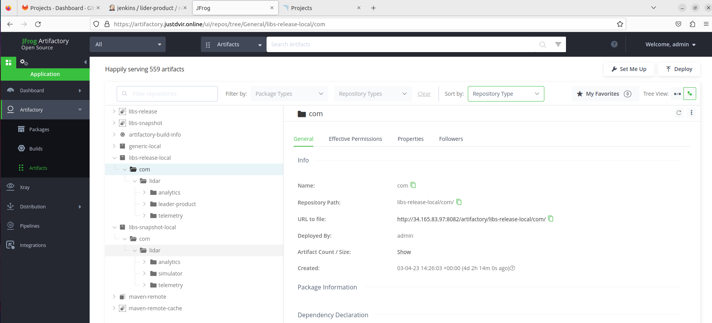

LeaderLidar
===========

LeaderLidar is a car safety vendor. Their primary product, LeaderLidar, is comprised of two packages:
- telemetry - a package that integrates to car metrics and formats them into an internal events protocol.
- analytics - a package that accepts events and decides on actions such as "beep" or "brake".

The company releases their product as a zip file.

You were recruited to help automate the company CI and Release processes.
 
for the full instractions refer to the task-instactions.txt file

# Main Things

* Created a lab with Docker Compose (you can check the lab files in the "lab" folder).

* Stored all the code on the hosted GitLab server.

* Created pipelines according to the tasks.

* Generated a settings.xml file from Artifactory, added the SonarQube setting to it, and then stored it in Jenkins.

* Ran tests in parallel to save time (in this scenario, I reduced time by 60%~).

* All the artifacts were sent to Artifactory, and the latest artifacts were pulled from there if needed.

* Integrated Slack notifications to a Slack channel for every build.

* Served all the labs with HTTPS.

* Created a Jenkins user for developers with view permissions to check their build logs.

* All the code was transferred through SonarQube to check the code quality.

To use HTTPS in your lab, refer to [this repo] I created for scenarios like this.

## Pictures
  
  
  
  
  
  

[//]: # 

[this repo]: <https://github.com/dvir-pashut/nginx-multiply-hosts>
